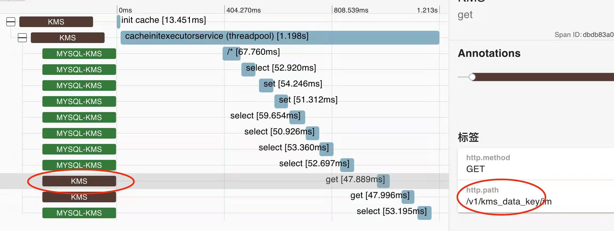
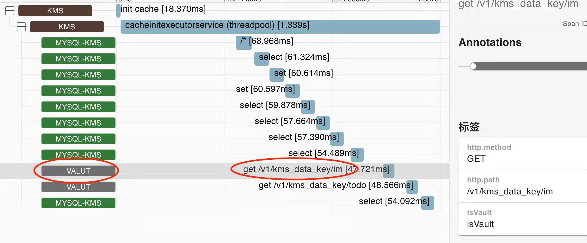

# Zipkin Vault 链路追踪采集器

## 简介

Zipkin 的 brave 库为 Java 开发者提供了各种常用组件链路追踪采集器

[GitHub - openzipkin/brave: Java distributed tracing implementation compatible with Zipkin backend services.](https://github.com/openzipkin/brave)

项目中使用到了 [Vault by HashiCorp](https://www.vaultproject.io/) 来管理密钥等敏感信息，因为是 springboot 项目，因此使用 spring cloud vault 操作 vault，使用 spring cloud sleuth 快速采集链路信息，但 spring cloud vault 不在 spring cloud 默认依赖中，因此 sleuth 没有默认支持，如果需要链路追踪功能得我们自己开发。

## 实践

废话不多说，直接开始，首先基于 brave 开发，版本如下:

> spring-boot：2.5.6
> spring-cloud：2020.0.4
> spring-cloud-sleuth：3.0.4
> spring-cloud-vault：3.0.4
> zipkin-brave：5.13.2

首先查看 VaultAutoConfiguration 了解 spring cloud vault 是如何初始化的，可以看出  spring cloud vault 是使用 restTemplate 和 vault 服务通信的，构造方法如下

```java
public VaultAutoConfiguration(ConfigurableApplicationContext applicationContext, VaultProperties vaultProperties,
		ObjectProvider<VaultEndpointProvider> endpointProvider,
		ObjectProvider<List<RestTemplateCustomizer>> customizers,
		ObjectProvider<List<RestTemplateRequestCustomizer<?>>> requestCustomizers) {
	。。。 。。。
}
```

### 方案一

VaultAutoConfiguration 通过构造注入了 RestTemplateCustomizer 来扩展 RestTemplate，有这个扩展点问题就简单了，我们只需要参考 spring cloud 对 RestTemplate
包装一下就行，代码如下：

```java
public class TracingVaultTemplateCustomizer implements RestTemplateCustomizer {

    private final BeanFactory beanFactory;

    public TracingVaultTemplateCustomizer(BeanFactory beanFactory) {
        this.beanFactory = beanFactory;
    }

    /**
     * @see org.springframework.cloud.vault.config.VaultConfiguration#createRestTemplateBuilder
     * @param restTemplate
     */
    @Override
    public void customize(RestTemplate restTemplate) {
        ArrayList<ClientHttpRequestInterceptor> interceptors = new ArrayList<>(restTemplate.getInterceptors());
        // LazyTraceClientHttpRequestInterceptor 由 sleuth 提供，因为 spring cloud 默认不保包含 vault，因此不用检查是否已经包装过
        interceptors.add(0, new LazyTraceClientHttpRequestInterceptor(beanFactory));
        restTemplate.setInterceptors(interceptors);
    }
}
```

然后把 TracingVaultTemplateCustomizer 注册到 spring，问题就解决了

```java
@Bean  
public RestTemplateCustomizer tracingRestTemplateCustomizer(BeanFactory beanFactory) {  
    return new TracingVaultTemplateCustomizer(beanFactory);  
}
```

效果如下：



方案一效果图有两个问题
- 1 由于 vault 服务没有接入 trace 因此展示了调用方 client 的名字，不够直白
- 2 跨度的名字是 get 不够直白

### 方案二

我们依然是从 RestTemplateCustomizer 入手，但需要对 sleuth 提供的 LazyTraceClientHttpRequestInterceptor 进行改造

```java
public class CustomLazyTraceClientHttpRequestInterceptor implements ClientHttpRequestInterceptor {

    private final BeanFactory beanFactory;

	// 修改为自己的实现
    private CustomTracingVaultClientHttpRequestInterceptor interceptor;

    public CustomLazyTraceClientHttpRequestInterceptor(BeanFactory beanFactory) {
        this.beanFactory = beanFactory;
    }

    @Override
    public ClientHttpResponse intercept(HttpRequest request, byte[] body, ClientHttpRequestExecution execution) throws IOException {
        if (isContextUnusable()) {
            return execution.execute(request, body);
        }
        return interceptor().intercept(request, body, execution);
    }

    boolean isContextUnusable() {
        return ContextUtil.isContextUnusable(this.beanFactory);
    }

    ClientHttpRequestInterceptor interceptor() {
        if (this.interceptor == null) {
            this.interceptor = this.beanFactory.getBean(CustomTracingVaultClientHttpRequestInterceptor.class);
        }
        return this.interceptor;
    }

}
```

在 CustomLazyTraceClientHttpRequestInterceptor 中我们替换了 interceptor 为 CustomTracingVaultClientHttpRequestInterceptor，具体实现如下，主要就是对跨度打了一个标签，标记是 vault 的跨度

```java
public class CustomTracingVaultClientHttpRequestInterceptor implements ClientHttpRequestInterceptor {

    。。。 。。。

    @Override
    public ClientHttpResponse
    intercept(HttpRequest req, byte[] body, ClientHttpRequestExecution execution) throws IOException {
        CustomTracingVaultClientHttpRequestInterceptor.HttpRequestWrapper request =
                new CustomTracingVaultClientHttpRequestInterceptor.HttpRequestWrapper(req);
        Span span = handler.handleSend(request);
        // 新增标签，标记是 vault 的跨度
        span.tag(IS_VAULT_SPAN, Boolean.TRUE.toString());
        if (log.isDebugEnabled()) {
            log.debug("Wrapping an outbound http call with span [" + span + "]");
        }
        ClientHttpResponse response = null;
        Throwable error = null;
        try (CurrentTraceContext.Scope ws = currentTraceContext.newScope(span.context())) {
            response = execution.execute(req, body);
            return response;
        } catch (Throwable e) {
            error = e;
            throw e;
        } finally {
            handler.handleReceive(new CustomTracingVaultClientHttpRequestInterceptor
                    .ClientHttpResponseWrapper(request, response, error), span);
        }
    }

   。。。 。。。

}
```

在链路上报前我们对便签进行处理，相关代码如下：

```java
public class CustomTracingVaultSpanHandler extends SpanHandler {

    @Override
    public boolean end(TraceContext context, MutableSpan span, Cause cause) {
        if (Boolean.TRUE.toString().equals(span.tag(IS_VAULT_SPAN))) {
            span.localServiceName("vault");
            span.name(span.name() + " " + span.tag("http.path"));
            span.removeTag(IS_VAULT_SPAN);
        }
        return true;
    }
}
```

最后将上述修改注入到 spring

```java
@Bean
public RestTemplateCustomizer tracingRestTemplateCustomizer(BeanFactory beanFactory) {
	return new CustomTracingVaultTemplateCustomizer(beanFactory);
}

@Bean
public CustomTracingVaultClientHttpRequestInterceptor
tracingRestTemplateCustomizer(CurrentTraceContext currentTraceContext,
							  HttpClientHandler httpClientHandler) {
	return new CustomTracingVaultClientHttpRequestInterceptor(currentTraceContext, httpClientHandler);
}

@Bean
public SpanHandler customTracingVaultSpanHandler() {
	return new CustomTracingVaultSpanHandler();
}
```

效果如下，可以看到方案一相关的问题解决了




上述代码现维护到了 github，目前代码还比较简单，欢迎大家一起扩展维护。

[GitHub - freshchen/zipkin-instrumentation: openzipkin 官方 instrumentation 的补充](https://github.com/freshchen/zipkin-instrumentation)


## 参考链接


##### 标签
