# PlantUML使用

[官网](https://plantuml.com/)

## 时序图

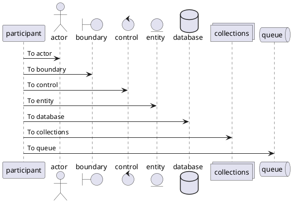


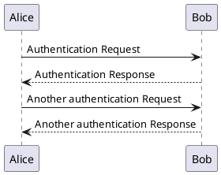


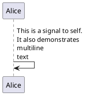


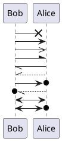


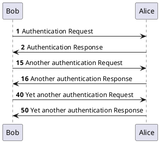

## 用例图

```plantuml

@startuml

:First Actor:
:Another\nactor: as Man2
actor Woman3
actor :Last actor: as Person1

@enduml

@startuml
:User: --> (Use)
"Main Admin" as Admin
"Use the application" as (Use)
Admin --> (Admin the application)
@enduml

@startuml
left to right direction
actor Guest as g
package Professional {
  actor Chef as c
  actor "Food Critic" as fc
}
package Restaurant {
  usecase "Eat Food" as UC1
  usecase "Pay for Food" as UC2
  usecase "Drink" as UC3
  usecase "Review" as UC4
}
fc --> UC4
g --> UC1
g --> UC2
g --> UC3
@enduml

@startuml
left to right direction
actor "Food Critic" as fc
rectangle Restaurant {
  usecase "Eat Food" as UC1
  usecase "Pay for Food" as UC2
  usecase "Drink" as UC3
}
fc --> UC1
fc --> UC2
fc --> UC3
@enduml

@startuml
left to right direction
skinparam packageStyle rectangle
actor customer
actor clerk
rectangle checkout {
  customer -- (checkout)
  (checkout) .> (payment) : include
  (help) .> (checkout) : extends
  (checkout) -- clerk
}
@enduml



```


## 类图


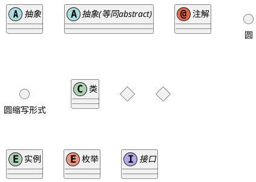

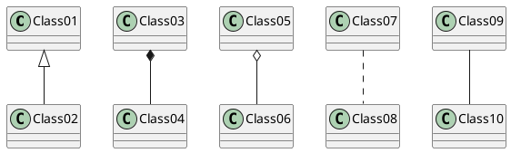

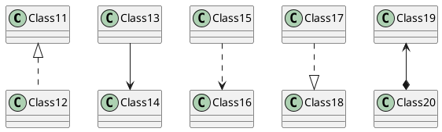

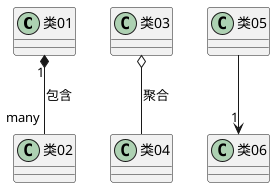

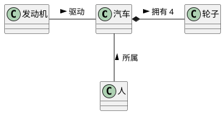

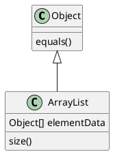


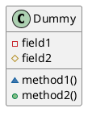

```plantuml
@startuml

class Foo
note left: On last defined class

note top of Object
  In java, <size:18>every</size> <u>class</u>
  <b>extends</b>
  <i>this</i> one.
end note

note as N1
  This note is <u>also</u>
  <b><color:royalBlue>on several</color>
  <s>words</s> lines
  And this is hosted by 
end note

@enduml

```

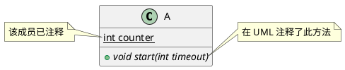

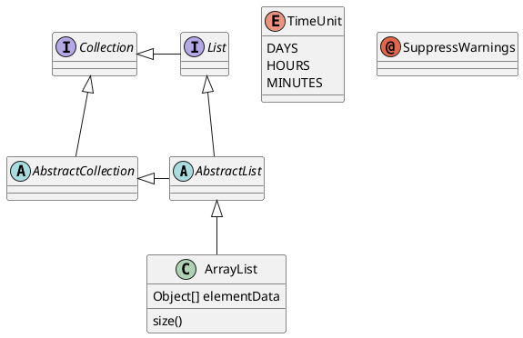

```plantuml
@startuml

class Foo<? extends Element> {
  int size()
}
Foo *- Element

@enduml

@startuml
class Student {
  Name
}
Student "0..*" - "1..*" Course
(Student, Course) .. Enrollment

class Enrollment {
  drop()
  cancel()
}
@enduml

```

## 活动图

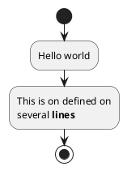


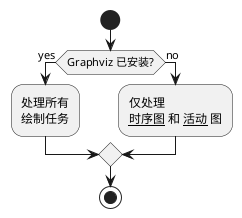


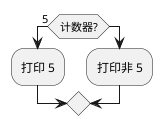


```plantuml
@startuml
start
if (条件 A) then (yes)
  :文本 1;
elseif (条件 B) then (yes)
  :文本 2;
  stop
elseif (条件 C) then (yes)
  :文本 3;
elseif (条件 D) then (yes)
  :文本 4;
else (nothing)
  :文本 else;
endif
stop
@enduml

```


```plantuml
@startuml
!pragma useVerticalIf on
start
if (条件 A) then (yes)
  :文本 1;
elseif (条件 B) then (yes)
  :文本 2;
  stop
elseif (条件 C) then (yes)
  :文本 3;
elseif (条件 D) then (yes)
  :文本 4;
else (nothing)
  :文本 else;
endif
stop
@enduml

```


```plantuml
@startuml
start
switch (测试?)
case ( 条件 A )
  :Text 1;
case ( 条件 B ) 
  :Text 2;
case ( 条件 C )
  :Text 3;
case ( 条件 D )
  :Text 4;
case ( 条件 E )
  :Text 5;
endswitch
stop
@enduml

```


```plantuml
@startuml
if (条件?) then
  :错误;
  stop
endif
#palegreen:行为;
@enduml

```


```plantuml
@startuml

start

repeat :foo作为开始标注;
  :读取数据;
  :生成图片;
backward:这是一个后撤行为;
repeat while (更多数据?)

stop

@enduml

```


```plantuml

```


## 参考链接


##### 标签
#tools #design 
