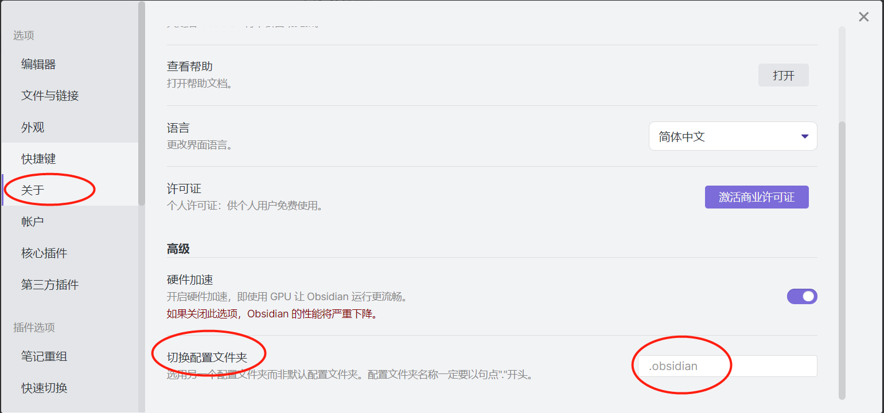
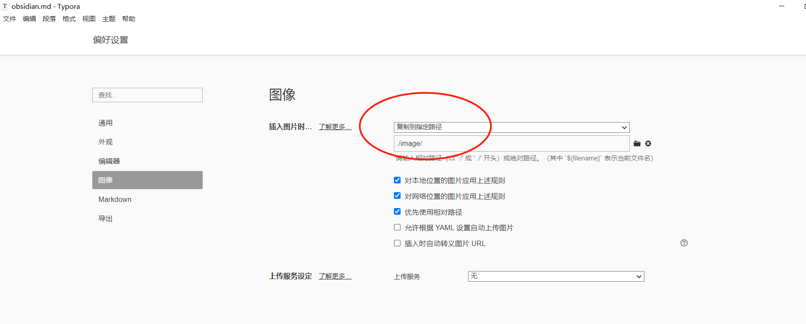
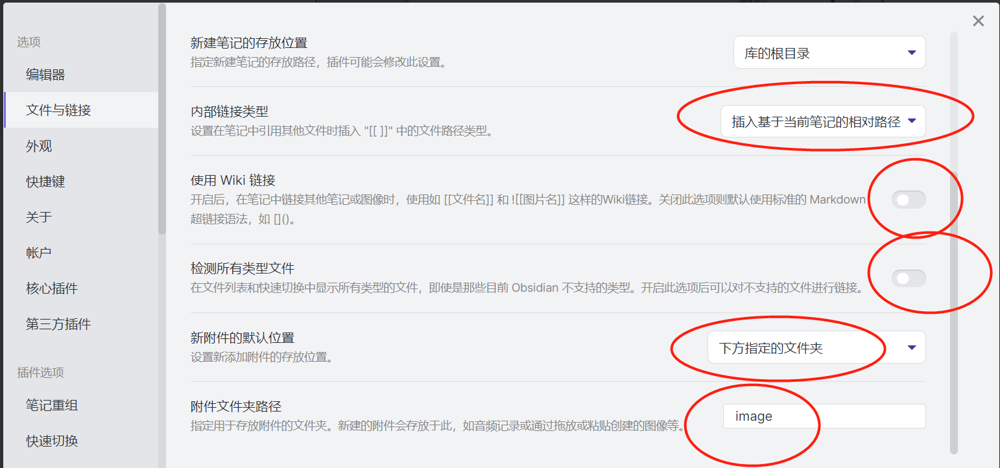

# obsidian 知识管理

- [知识收集记录](../../methodology/Zettelkasten卡片盒笔记法.md#^2098e6)，使用 Onenote，主要依赖其多端同步能力。
- [知识的整理、吸收、内循环](../../methodology/Zettelkasten卡片盒笔记法.md#^3eed29)使用 obsidian + typora。

## 插件列表

- calendar 日历
- dataview 类似notion数据库
- folder-note-plugin
- obsidian-day-planner
- obsidian-emoji-toolbar
- obsidian-glt
- obsidian-kanban
- obsidian-mind-map
- obsidian-outliner
- table-editor-obsidian
- templater-obsidian

## 项目配置

obsidian不同项目配置不同，默认配置在项目当前 .obsidian 目录下，可以指定配置位置或者拷贝到当前项目

## 结合Typora图片显示

1 typora 配置

2 obsidian 配置

## 参考链接

[插件](https://zhuanlan.zhihu.com/p/410202700)

[Obsidian 插件之 Dataview](https://zhuanlan.zhihu.com/p/373623264)

[Obsidian 插件之 QuickAdd](https://zhuanlan.zhihu.com/p/386885976)

[模板+QuickAdd+Dataview](https://sspai.com/post/68350)

[Dataview 中文文档](https://zhuanlan.zhihu.com/p/393550306)

##### 标签
#tools 